# End-to-End DevSecOps Automation using Terraform, Jenkins & Amazon EKS


---

## Project Overview

This project demonstrates a complete end-to-end **DevSecOps CI/CD pipeline** on AWS using Terraform, Jenkins, Docker, Docker Hub, Amazon EKS, ArgoCD, Prometheus, and Grafana.

The project automates:

- Infrastructure provisioning using Terraform
- Kubernetes cluster deployment on Amazon EKS
- CI/CD automation using Jenkins Pipeline
- Static code analysis using SonarQube
- Dependency vulnerability scanning using OWASP Dependency Check
- Container security scanning using Trivy
- Docker image creation and push to Docker Hub
- GitOps deployment using ArgoCD
- Monitoring and visualization using Prometheus and Grafana

---

## Architecture Workflow

<p align="center">
  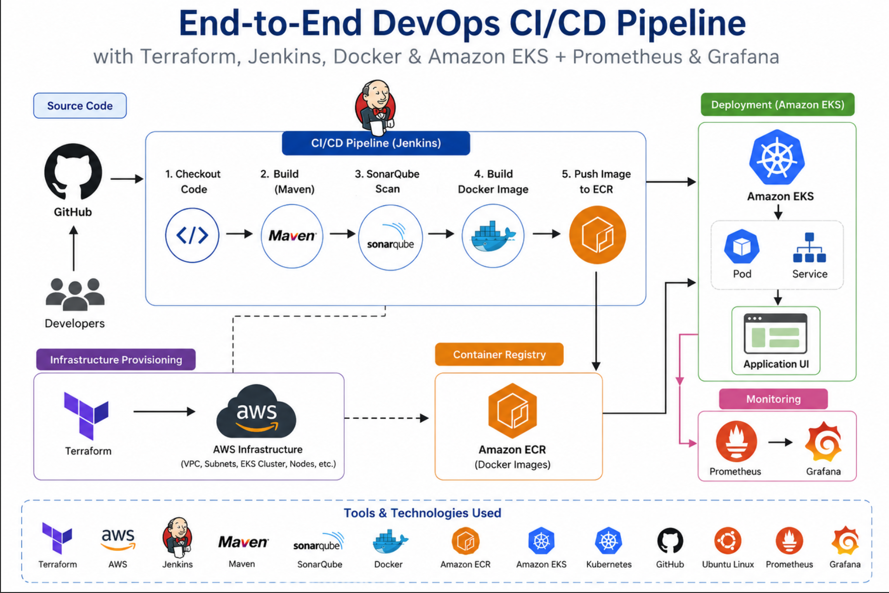
</p>

---

## Infrastructure Setup

- Created a dedicated AWS EC2 instance as the DevOps admin server for EKS management and pipeline execution.
- Configured IAM Admin Role for infrastructure provisioning and Kubernetes cluster management.
- Updated and upgraded the server packages.

### Server Update Commands

```bash
apt update -y && apt upgrade -y
```

---

## Installed Tools and Services

The following tools were installed and configured on the admin server:

- AWS CLI
- kubectl
- eksctl
- Terraform
- Jenkins
- Docker
- Helm
- Trivy

### Jenkins Installation

```bash
sh jenkins-install.sh
```

### Docker Installation

```bash
apt install docker.io -y
```

### Trivy Installation

```bash
sudo apt-get install wget apt-transport-https gnupg lsb-release -y
wget -qO - https://aquasecurity.github.io/trivy-repo/deb/public.key | sudo apt-key add -
echo deb https://aquasecurity.github.io/trivy-repo/deb $(lsb_release -sc) main | sudo tee -a /etc/apt/sources.list.d/trivy.list
sudo apt-get update && sudo apt-get install trivy -y
```

---

## Terraform Infrastructure Provisioning

Terraform was used to provision the complete AWS infrastructure using modular configuration files.

### Terraform Files

- `vpc.tf`
- `eks.tf`
- `outputs.tf`

### Infrastructure Created

- VPC
- Public & Private Subnets
- Internet Gateway & NAT Gateway
- Route Tables
- IAM Roles & Policies
- Amazon EKS Cluster
- Managed Node Groups

### Terraform Commands

```bash
terraform init
terraform plan
terraform apply
```

### Verify EKS Cluster

```bash
aws eks list-clusters
```

### Configure kubectl Access

```bash
aws eks update-kubeconfig --name DevSecOps-Cluster --region us-east-1
```

### Verify Worker Nodes

```bash
kubectl get nodes -o wide
```

<p align="center">
  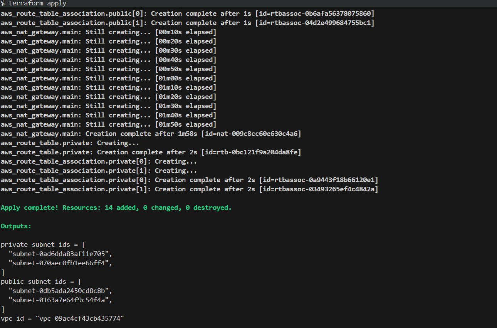
</p>

<details>
<summary><b>View Terraform State Resources</b></summary>

<br>

<p align="center">
  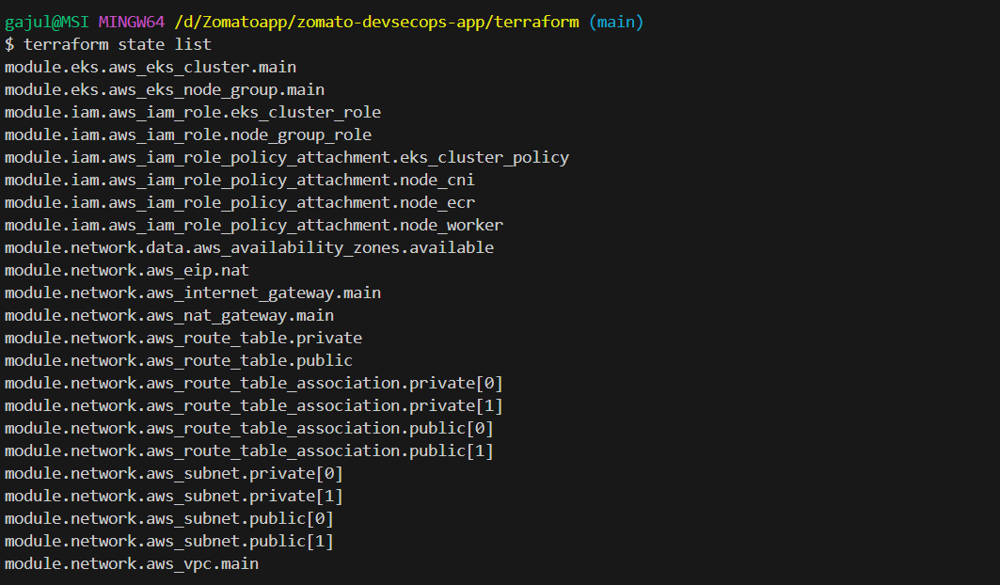
</p>

</details>

---

## EKS Cluster Information

The EKS cluster `DevSecOps-Cluster` was successfully provisioned with 3 managed worker nodes running Kubernetes v1.29.

<p align="center">
  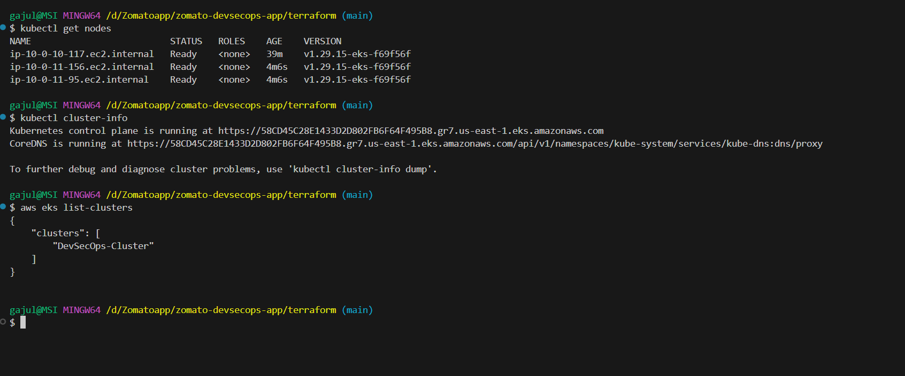
</p>

---

## SonarQube Integration

SonarQube was configured as a Jenkins plugin and integrated into the pipeline for static code analysis.

### SonarQube Setup Workflow

- Installed and configured SonarQube on the Jenkins server
- Generated authentication token
- Configured SonarQube credentials and webhook inside Jenkins
- Integrated code analysis and Quality Gate validation into Jenkins Pipeline

### SonarQube Results

- 1 Bug detected (Reliability: C)
- 0 Vulnerabilities (Security: A)
- 2 Security Hotspots
- 2 Code Smells (Maintainability: A)
- 0 Duplicated Blocks
- Quality Gate: **Passed**

<details>
<summary><b>View SonarQube Dashboard</b></summary>

<br>

<p align="center">
  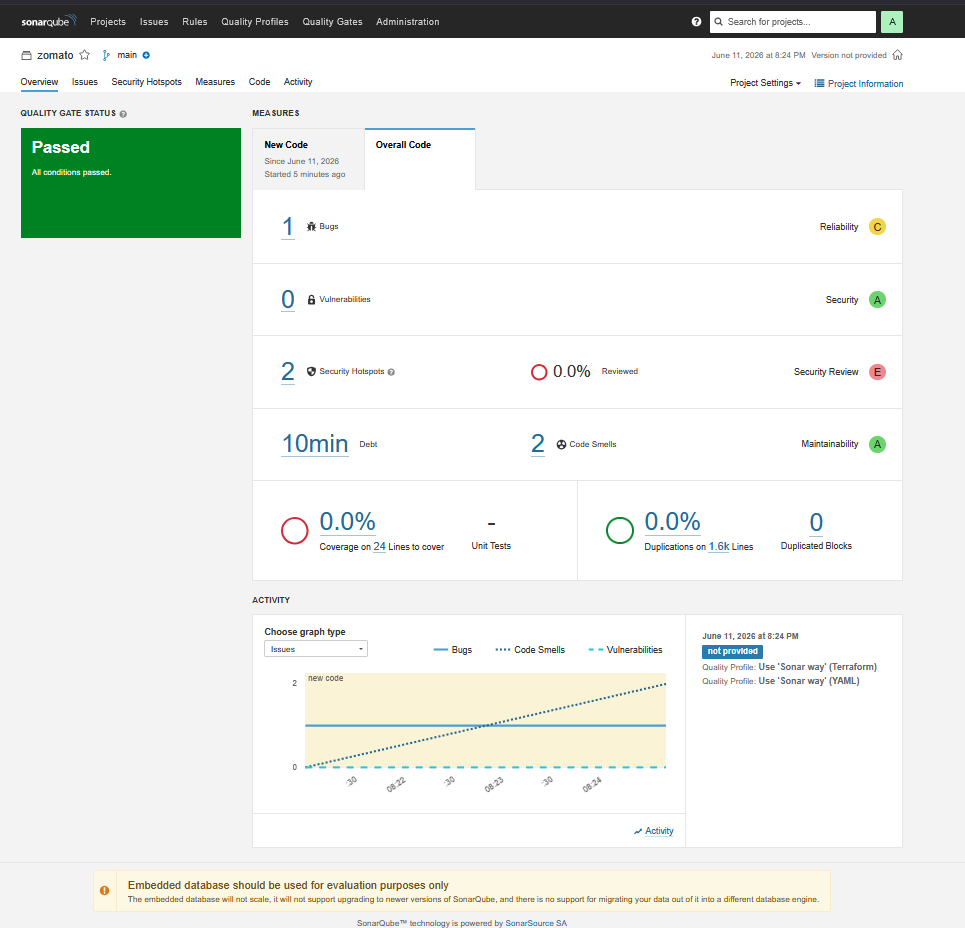
</p>

</details>

---

## Jenkins DevSecOps Pipeline

A declarative Jenkins Pipeline (`Jenkinsfile`) was implemented to automate the complete CI/CD and security workflow.

### Pipeline Stages

1. Clean Workspace
2. Checkout Code
3. SonarQube Analysis
4. Quality Gate Validation
5. Install Dependencies
6. OWASP Dependency Check
7. Trivy File System Scan
8. Docker Build
9. Trivy Image Scan
10. Docker Push
11. Update Deployment Manifest

<details>
<summary><b>View Jenkins Pipeline Execution</b></summary>

<br>

<p align="center">
  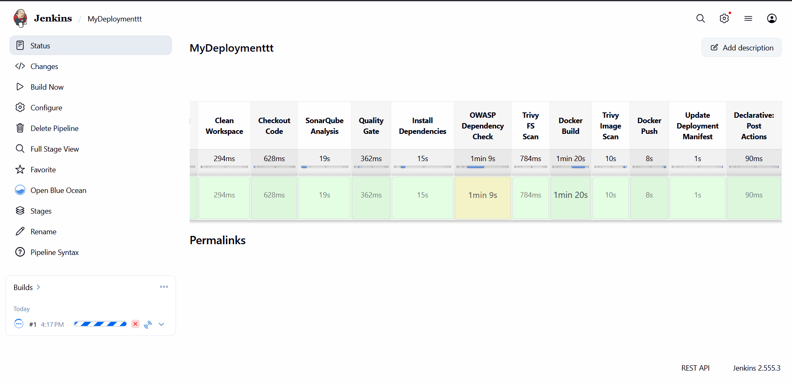
</p>

</details>

---

## Jenkins Docker Permissions

To allow Jenkins to execute Docker commands, Docker permissions were configured for the Jenkins user.

### Commands Used

```bash
sudo usermod -aG docker jenkins
sudo systemctl restart jenkins
groups jenkins
```

---

## Jenkins Access to Kubernetes Cluster

Configured Jenkins user access to the EKS cluster for manifest update operations.

### Commands Used

```bash
sudo su - jenkins
aws configure
aws eks update-kubeconfig --name DevSecOps-Cluster --region us-east-1
kubectl get nodes
```

---

## Docker Hub Image Management

Application container images are built and pushed automatically to Docker Hub as part of the Jenkins pipeline.

### Docker Hub Repository

<details>
<summary><b>View Docker Hub Repository</b></summary>

<br>

<p align="center">
  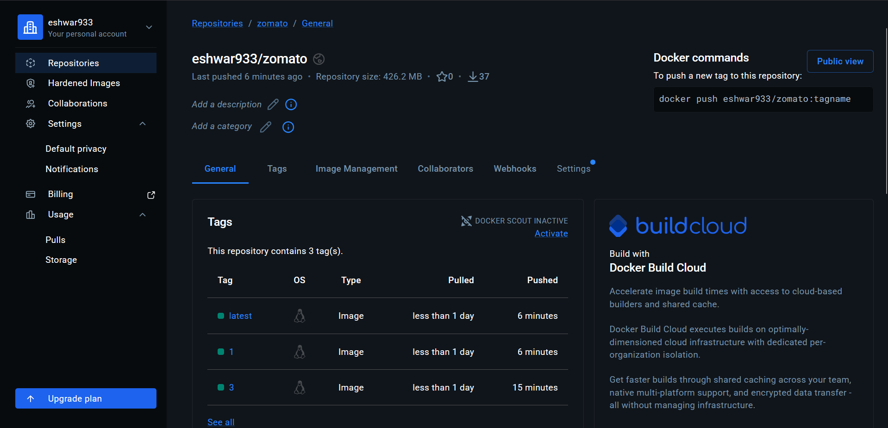
</p>

</details>

### Docker Commands

```bash
# Build image
docker build -t eshwar933/zomato:$BUILD_NUMBER .

# Push image
docker push eshwar933/zomato:$BUILD_NUMBER
docker push eshwar933/zomato:latest
```

---

## GitOps Deployment using ArgoCD

ArgoCD continuously monitors the Kubernetes manifests stored in GitHub and automatically synchronizes them with the EKS cluster.

### ArgoCD Features Used

- Auto Sync enabled
- Self-healing enabled
- History and Rollback
- Application health monitoring

### ArgoCD Application Status

- **App Health:** Healthy
- **Sync Status:** Synced to HEAD
- **Resources:** Service, Deployment, ReplicaSet, 3 Pods — all running

<details>
<summary><b>View ArgoCD Application Tree</b></summary>

<br>

<p align="center">
  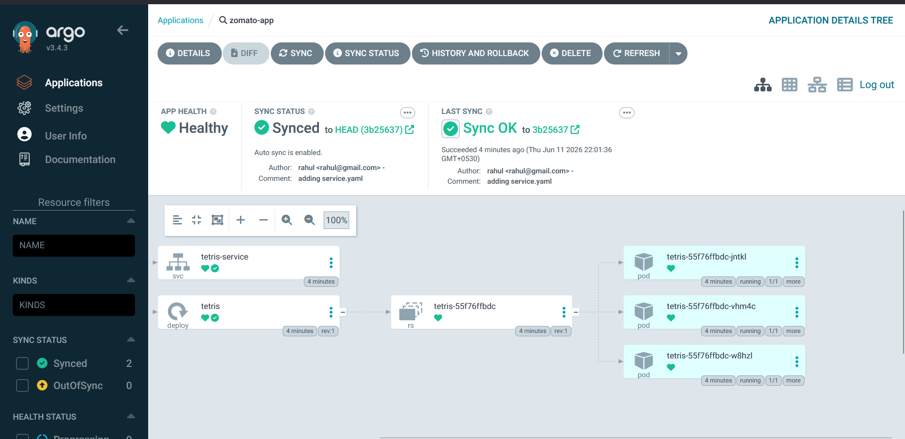
</p>

</details>

---

## Application Deployment

The application was deployed to Amazon EKS using Kubernetes Deployment and Service manifests managed through ArgoCD.

### Deployment Verification Commands

```bash
kubectl get all -n default
kubectl get pods
kubectl get svc
```

### Kubernetes Resources

<details>
<summary><b>View Kubernetes Deployment, Pods & Services</b></summary>

<br>

<p align="center">
  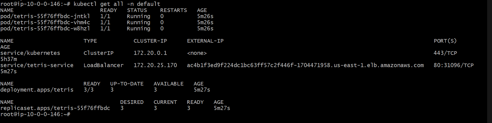
</p>

</details>

The application is exposed via a Kubernetes **LoadBalancer** Service, accessible through an AWS ELB endpoint on port 80.

### Application Output

<p align="center">
  
</p>

---

## Monitoring and Observability

Prometheus and Grafana were integrated into the Kubernetes cluster for comprehensive monitoring and visualization.

### Monitoring Stack Setup

- Installed Prometheus using Helm in the `prometheus` namespace
- Installed Grafana using Helm
- Exposed services using Kubernetes NodePort/LoadBalancer
- Configured Prometheus as the Grafana data source

### Helm Installation Commands

```bash
snap install helm --classic

kubectl create namespace prometheus

helm repo add prometheus-community https://prometheus-community.github.io/helm-charts
helm repo update

helm install prometheus prometheus-community/kube-prometheus-stack \
  --namespace prometheus \
  --set prometheus.service.nodePort=30000 \
  --set prometheus.service.type=NodePort \
  --set grafana.service.nodePort=31000 \
  --set grafana.service.type=NodePort \
  --set alertmanager.service.nodePort=31001 \
  --set alertmanager.service.type=NodePort \
  --set prometheus-node-exporter.service.nodePort=31002 \
  --set prometheus-node-exporter.service.type=NodePort
```

### Verify Monitoring Pods

```bash
kubectl get pods -n prometheus
```

### Access Prometheus and Grafana

```bash
kubectl get svc -n prometheus
```

### Prometheus Targets

Prometheus is actively scraping metrics from:

- Grafana
- AlertManager
- kube-state-metrics
- Node Exporter (all nodes)
- Kubernetes API Server

<details>
<summary><b>View Prometheus Target Health</b></summary>

<br>

<p align="center">
  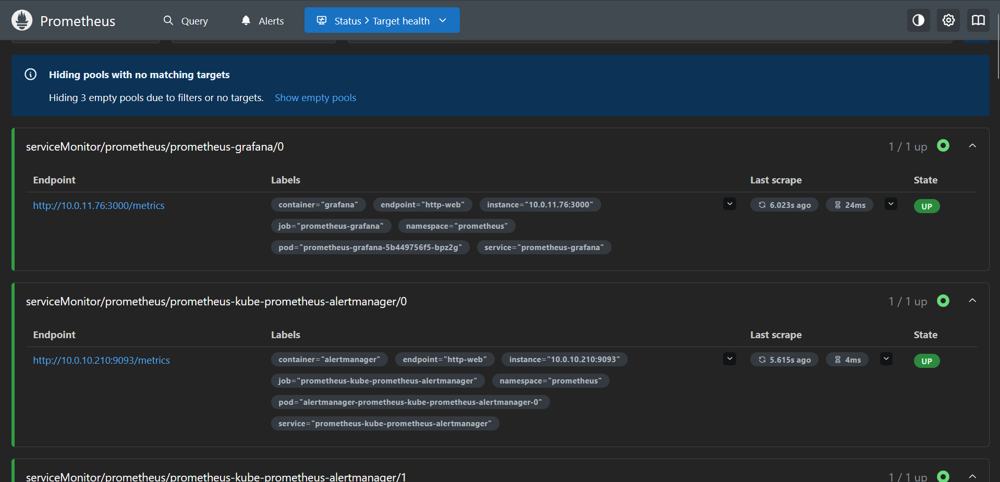
</p>

</details>

### Grafana Dashboards

Imported Grafana dashboards for full cluster observability:

| Dashboard | ID |
|---|---|
| Node Exporter Full | 1860 |
| Kubernetes Cluster Monitoring | 7249 |
| Kubernetes / Views / Global | 15757 |
| Kubernetes Cluster (Prometheus) | 315 |

<details>
<summary><b>View Node Exporter Full Dashboard</b></summary>

<br>

<p align="center">
  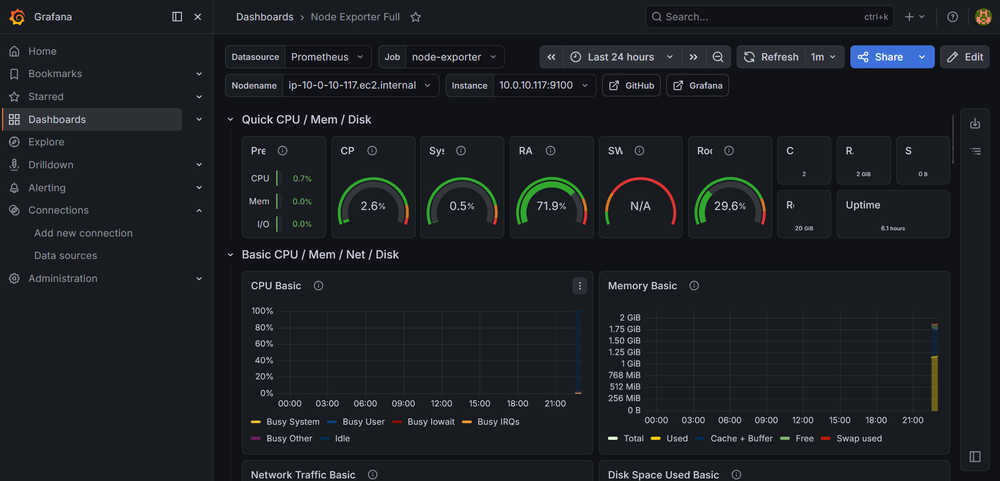
</p>

</details>

<details>
<summary><b>View Kubernetes Cluster Dashboard</b></summary>

<br>

<p align="center">
  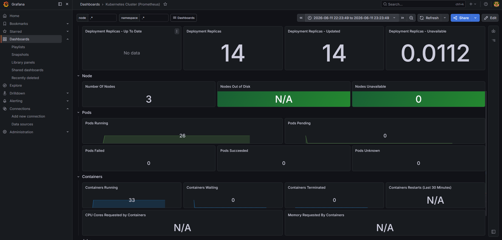
</p>

</details>

<details>
<summary><b>View Kubernetes Views Global Dashboard</b></summary>

<br>

<p align="center">
  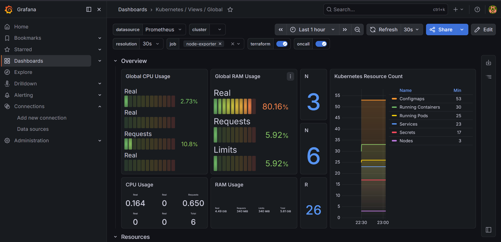
</p>

</details>

<details>
<summary><b>View Kubernetes Cluster (Prometheus) Dashboard</b></summary>

<br>

<p align="center">
  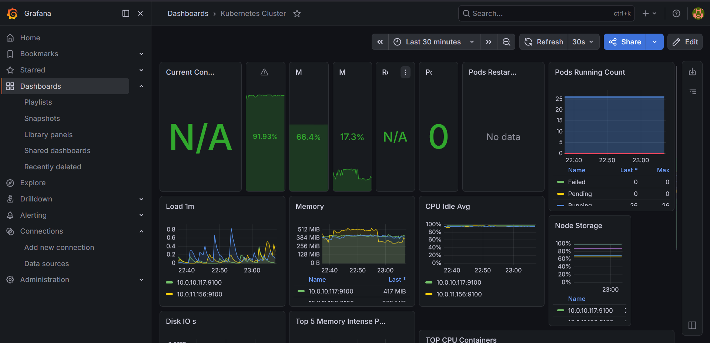
</p>

</details>

---

## Security Implementations

✅ SonarQube Static Code Analysis

✅ Quality Gate Enforcement in Jenkins

✅ OWASP Dependency Check

✅ Trivy File System Scan

✅ Trivy Container Image Scan

✅ GitOps Deployment using ArgoCD (no direct cluster access)

✅ Kubernetes Deployment Best Practices

---

## Key Learnings

- Infrastructure as Code using Terraform with modular VPC and EKS configurations
- DevSecOps pipeline design with security gates at every stage
- Static code analysis and Quality Gate enforcement using SonarQube
- Dependency and container vulnerability scanning using OWASP and Trivy
- GitOps deployment patterns using ArgoCD
- Kubernetes deployment and management on Amazon EKS
- Docker image management using Docker Hub
- Monitoring Kubernetes workloads using Prometheus and kube-prometheus-stack
- Grafana dashboard visualization and observability at cluster and node level

---

## 👨‍💻 Author

**Eshwar Gajula**

DevOps | Cloud | Kubernetes | AWS | Terraform | CI/CD | DevSecOps Engineer